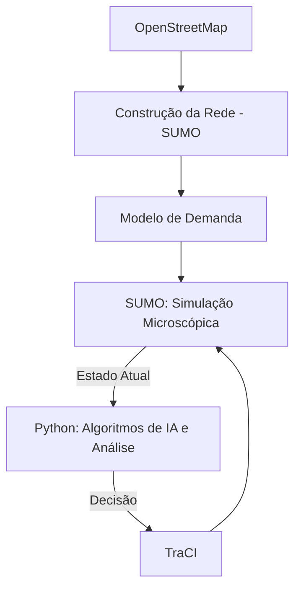

# Especificações Técnicas e Arquiteturais

Este documento define as especificações tecnológicas, estruturais e conceituais do projeto de pesquisa de mobilidade urbana em Aracaju e São Cristóvão. Serve como memória central técnica do agente para os trabalhos de desenvolvimento.

## 1. Stack Tecnológico e Ferramentas

- **Plataforma de Simulação Principal:** Eclipse SUMO (Simulation of Urban MObility) - Simulador microscópico e multimodal.
- **Linguagem de Orquestração:** Python.
- **Interface de Controle (API):** TraCI (Traffic Control Interface) para desenvolvimento inicial, com possibilidade de migração futura para libsumo por motivos de performance.
- **Fontes de Dados:** OpenStreetMap (OSM) para obtenção primária da malha viária e da infraestrutura.

## 2. Arquitetura Conceitual de Integração

A plataforma funciona em um ciclo de execução contínuo (loop) separando rigidamente os domínios da simulação dos processos de tomada de decisão.

- **Separação de Preocupações:** (1) Infraestrutura, (2) Demanda, (3) Motor de Simulação, (4) Inteligência e (5) Avaliação e Métricas.

## 3. Modelagem de IA e Otimização

### 3.1. Busca em Grafos e Roteamento
As viagens na rede são tratadas como problemas de busca no grafo $G=(V,E)$.
- **Dijkstra:** Serve como baseline comparativo para roteamento.
- **A*:** Algoritmo principal, com experimentação de heurísticas adaptadas para intermodalidade.
- **Função de Custo ($C$):** Multimodal e customizada ($C = w_tT + w_dD + w_bB + w_{tr}N_{tr} + w_cC$), considerando Tempo de viagem ($T$), Distância ($D$), Penalidade da bike ($B$), Transferências ($N_{tr}$) e Custo financeiro ($C$).

### 3.2. Sistemas Baseados em Agentes
Usuários são agentes heterogêneos orientados por diferentes funções de utilidade (ex.: baseadas em tempo mínimo, rejeição a transferências ou afinidade ao modo bicicleta). As escolhas individuais baseadas na utilidade guiarão a distribuição do tráfego.

### 3.3. Algoritmos de Otimização e Controle
- Estratégias como **Hill Climbing** e **Algoritmos Genéticos** poderão ser utilizadas para otimizar parâmetros globais (ex: configuração semafórica) mitigando tempo de espera e emissões de carbono sem penalizar um modal específico.

### 3.4. LLMs / VLMs
Serão empregados isoladamente como atuadores *downstream* após a simulação. Eles farão o parsing dos artefatos visuais e tabulares gerados em Python e emitirão análises descritivas textuais (ex.: identificando trade-offs entre modo cicloviário e congestionamento sem tomar decisões autoritativas).

## 4. Estrutura do Diretório do Projeto

A organização de pastas foi pensada para manter alta modularidade e garantir reprodutibilidade e empacotamento.

- `data/`: Armazenamento de dados base (redes OSM, arquivos de demanda e dados externos).
- `sumo/`: Artefatos específicos para o SUMO (configurações da rede, definição de rotas, scripts estáticos dos cenários e controladores semafóricos).
- `src/`: Lógica central do orquestrador (simulação, roteamento intermodal, funções de custo, modelagem de agentes, algoritmos genéticos/hill climbing e coletores de dados).
- `experiments/`: Configurações parametrizadas (seeds, variáveis experimentais) para rodar experimentos reprodutíveis.
- `results/` e `figures/`: Saídas da simulação, tabelas de métricas tabulares, e visualizações em gráficos.
- `docs/` e `tests/`: Documentação geral, especificações e testes da arquitetura.

## 5. Práticas de Desenvolvimento e Reprodutibilidade
- Execuções múltiplas com sementes e parametrizações diferentes são obrigatórias em todo experimento para permitir avaliação estatística válida ($\bar{X}\pm\sigma_X$).
- Mudanças (por exemplo, adesão de bicicletas no modo C2) devem ser construídas baseadas em ranges parametrizáveis (ex.: 0.1 a 0.5) em vez de números fixos aleatórios, visando permitir Análises de Sensibilidade.
